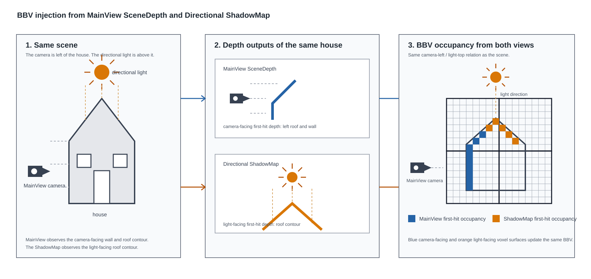

# InstantRDV for Unreal Engine

[English](README.md) | [日本語](README.ja.md)

This repository contains an Unreal Engine 5.8 plugin and sample project for the InstantRDV technical demo.

InstantRDV incrementally constructs and maintains a GPU voxel scene from rasterization pipeline outputs. RdvGI is a real-time global illumination demo built on InstantRDV. It does not use hardware ray tracing.

## Demo video

▶ [Watch on YouTube](https://www.youtube.com/watch?v=Mr9syMFeEFI)

RdvGI enabled and disabled in the Unreal Engine sample scene:

| RdvGI OFF | RdvGI ON |
|---|---|
|  |  |

## Terminology

- **RDV — Raster Derived Voxel**: A voxel scene derived from raster pass outputs.
- **BBV — Bitmask Brick Voxel**: A brick voxel grid that stores occupancy as bitmasks.
- **RdvGI**: A real-time global illumination implementation built on InstantRDV.
- **VSP — Visible Surface Probe**: A probe system that places probes on visible surfaces for GI evaluation.

## InstantRDV: GPU voxel scene construction from rasterization

Conventional voxelization requires an additional geometry rasterization pass or CPU-to-GPU transfer of scene data. InstantRDV uses the DepthBuffer already generated during main-view rendering. It reconstructs world-space surface positions from depth and updates BBV with compute shaders. No additional geometry pass or CPU-side voxel build is required. The current implementation uses MainView input only.

The design is not restricted to the MainView DepthBuffer. Any raster output that can reconstruct world-space surface positions can update BBV, including ShadowMaps, GBuffer data, and custom surface caches.

SceneDepth supplies geometry occupancy. SceneColor supplies BrickRadiance. Other raster outputs, including GBuffer data, can be used in the same way.

BBV voxel occupancy and brick radiance debug views:

| Voxel occupancy | Brick radiance |
|---|---|
|  |  |

### BBV: Bitmask Brick Voxel

BBV groups voxels into bricks so high-frequency geometry and lower-frequency material data can use different representations. Space is divided into a brick grid, and each brick stores voxel occupancy as a bitmask. The grid follows the camera as a ToroidalGrid and uses a dense layout for fast access. In the demo, one brick contains 8x8x8 voxels and is represented by 512 bits. A 64^3-brick grid provides geometry voxel resolution equivalent to 512^3 voxels.

BBV also stores lower-frequency data per brick. The demo stores SceneColor-derived radiance as coarse brick radiance and samples it at BBV ray-trace hit locations for RdvGI.

Surfaces reconstructed from DepthBuffer are added to occupancy through voxel **injection**. Areas that are no longer observed after camera movement or coverage changes are removed through **removal**. These incremental updates keep BBV synchronized with the scene in real time.

### BBV voxel injection

Surface samples reconstructed from a DepthBuffer side view are injected directly into the BBV brick grid. The compute shader uses Wave Intrinsics to reduce writes, then updates occupancy through atomic operations.

RDV can use any data that reconstructs world-space surfaces in the same way as MainView DepthBuffer. For example, a Directional ShadowMap can be used as an additional raster input to inject occupancy from first-hit depth in the light view. Geometry hidden from MainView can then be updated where it is observed as a shadow caster.

### BBV voxel removal

Injection alone cannot track a dynamic scene. BBV projects voxels into the current camera view and compares voxel depth with SceneDepth samples to remove regions that are no longer occupied. If voxel depth is smaller than SceneDepth, the occupancy is removed; otherwise it is retained.

### BBV ray tracing

BBV supports voxel ray tracing from compute shaders. Ray traversal tests BBV occupancy to detect surface hits. VSP visibility capture, probe relocation, and debug visualization use this ray tracing. No hardware ray-tracing scene is required.

## RdvGI: probe-based GI on RDV

RdvGI is a GI implementation that uses BBV ray tracing. Similar to Enshrouded GI and SurfelGI, it updates probes from visible surfaces.

VSP places and reuses sparse probes from surface cells observed through DepthBuffer. Each probe captures radiance and sky visibility into an octahedral map with BBV ray tracing, then projects the result to L1 spherical harmonics. The projection is propagated into cascaded IrradianceVolumes. Material evaluation trilinearly samples the volume to obtain indirect diffuse irradiance and sky-visibility IBL.

Probe ray origins are relocated outside their associated surfaces. Capture uses these relocated origins, so GI evaluation does not use DDGI-style probe validity weights or visibility-weighted interpolation. Evaluation performs cascade selection, boundary dithering, hardware trilinear filtering, and SH evaluation.

An ActiveProbe octahedral map stores radiance and sky visibility from BBV ray tracing.

ActiveProbe and IrradianceVolume debug views:

| ActiveProbe | IrradianceVolume |
|---|---|
|  |  |

## GPU update flow

InstantRDV uses one selected MainView as input. BBV geometry updates run before BasePass. BrickRadiance and VSP update after lighting and before tonemapping. The latter updates once for one owner view in a ViewFamily.

1. **Toroidal BBV tracking**: The BBV grid moves with the camera. Bricks entering the grid are cleared.
2. **Surface sample construction**: World-space surface positions are reconstructed from MainView SceneDepth. The ReducedSurface path stores depth, normal, and normal confidence as low-resolution surface samples shared by geometry, BrickRadiance, and VSP updates.
3. **Incremental geometry update**: Surface samples inject BBV voxels. Removal clears voxels remaining in front of the current depth surface. Injection aggregates updates to the same occupancy word with Wave Intrinsics before atomic operations.
4. **BrickRadiance update**: SceneColor after lighting and before tonemapping is associated with occupancy surfaces. Coarse radiance accumulated and averaged per brick becomes the hit radiance for later BBV ray tracing.
5. **Visible Surface Probe update**: Visible surfaces are mapped to VSP cells and only visible cells are compacted. Required probes are allocated from the probe pool, and probe origins are relocated with surface anchors and BBV ray tracing.
6. **Probe capture**: Each active probe traces 6x6 octahedral ray directions through BBV occupancy. Hits provide brick radiance; misses provide sky visibility. Both are written to the ActiveProbe octahedral map. Work scales with active probes and ray requests rather than the full grid.
7. **IrradianceVolume update**: Octahedral maps are integrated into L1 SH and update the IrradianceVolume at probe owner cells. Nearby SH values are checkerboard-propagated into cells without probes.

Material shaders evaluate the cascaded IrradianceVolume independently from the update passes. After cascade selection and boundary dithering, L1 SH is evaluated with the surface normal to obtain diffuse irradiance and sky-visibility IBL.

## Unreal Engine integration

### Debug menu

Open `Tools > Debug > Instant-RDV > Instant-RDV Debug`. The menu has Runtime, BBV, VSP, and Debug sections. Runtime toggles InstantRDV, RdvGI, and ReducedSurfaceBuffer. BBV and VSP expose update paths and evaluation options. Debug visualizes BBV, ActiveProbe, and IrradianceVolume.

### Level Settings Actor

`InstantRdvSettingsActor` is an Actor class under `Plugins > Instant-RDV > InstantRdv > Public`. Place it in a level and change level-specific settings in the Details panel. `Enabled` toggles InstantRDV including BBV. `Gi Enabled` toggles VSP updates and material GI output. BBV updates are unaffected by `Gi Enabled`. Level-specific parameters are available for BBV, VSP, rendering, LOD, and relocation.

CVars can disable features at runtime.

- `r.InstantRdv.Enable`: InstantRDV core functionality.
- `r.InstantRdv.Gi.Enable`: RdvGI.

Both CVars default to enabled. The Settings Actor defaults for `Enabled` and `Gi Enabled` are disabled. No processing runs until an Actor placed in the level enables the required functionality.

### Material Function

`MF_Irdv_SampleGi` is a Material Function in the plugin Content. Call it from a Material Graph. Connect Absolute World Position to `InSamplePosition` and VertexNormalWS to `InSampleNormal`. Its Custom Node includes `instant_rdv_material.ush` and calls `InstantRdvMaterialTryEvaluateIndirectLighting`.

`Irradiance` output is incident irradiance `E`. `Irradiance/PI` is `E / PI`. To add Lambert diffuse light through Emissive, multiply Base Color by `Irradiance/PI`. `SkyVisibility` is an occlusion factor for SkyLight and IBL.

## Implementation notes

- Main-view injection/removal, radiance update, VSP update, and the reduced-surface path can be observed independently through CVars.
- VSP manages the probe pool, active probe list, ray request/result data, probe atlas, and IrradianceVolume as GPU resources.
- VSP retains GPU resources while GI is disabled.
- BrickRadiance outside MainView is not updated. High-radiance bricks remain after they move off-screen.

## Initial parameters

| Item | Default |
|---|---:|
| BBV grid | `64 x 64 x 64` bricks |
| BBV brick size | `300 cm` |
| VSP grid | `16 x 16 x 16` cells per cascade |
| VSP cell size | `200 cm` |
| VSP cascade count | `5` |
| Sparse probe pool | `8192` probes shared across cascades |
