# InstantRDV for Unreal Engine
本リポジトリにはInstantRDVデモ実装の Unreal Engine 5.8 向けプラグインとサンプルプロジェクトを含みます。

InstantRDV は ラスタライズ描画パイプライン の成果物から GPU voxel scene を逐次構築・維持する仕組みです。
RdvGi は InstantRDVを利用したリアルタイムGIのデモ実装です。(ハードウェアレイトレース不使用)

UE サンプルシーンでの RdvGI の ON/OFF 比較です。

| RdvGI OFF | RdvGI ON |
|---|---|
| 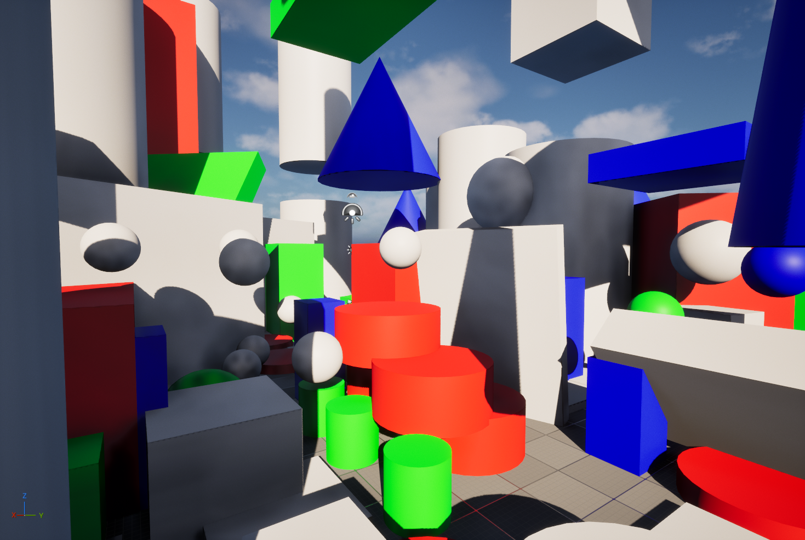 | 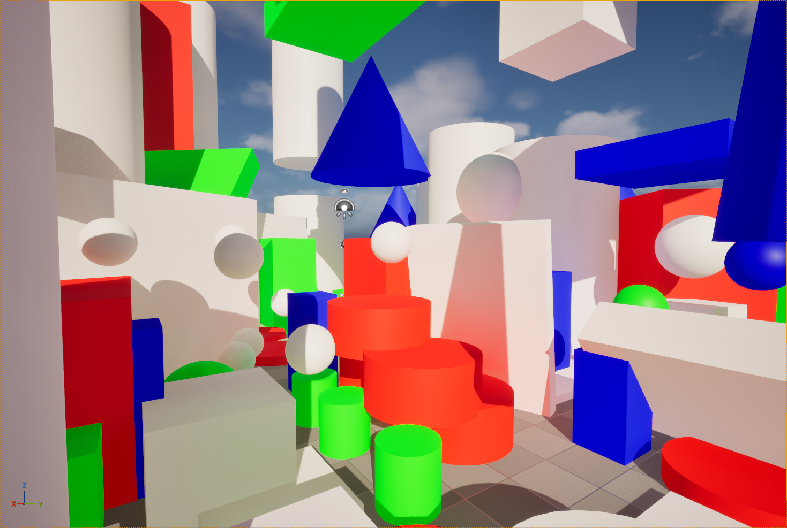 |

## Terminology

- **RDV — Raster Derived Voxel**: Raster Pass の成果物から導出する voxel scene。
- **BBV — Bitmask Brick Voxel**: occupancy を bitmask で保持する brick voxel grid。
- **RdvGI**: InstantRDV の仕組みを利用した real-time global illumination 実装。
- **VSP — Visible Surface Probe**: 可視 surface 上に Probe を配置して GI 計算を行う probe system。

## InstantRDV: Raster 成果物を流用した GPU Voxel Scene 構築

一般的な voxelization では、scene geometry の追加 rasterization または CPU 側 scene data の GPU 転送を行います。InstantRDV は main view rendering で生成済みの DepthBuffer を入力として利用します。Depth から world-space surface position を復元し、Compute Shader で BBV を更新します。追加 geometry pass および CPU-side voxel build は不要です。(でも実装ではMainViewのみです)

入力は MainView の DepthBuffer に限りません。world-space surface position を復元できる Raster 成果物を BBV 更新に使用できます。ShadowMap、GBuffer、独自の surface cache も使用できます。

SceneDepth は geometry occupancy、SceneColor は BrickRadiance の入力です。GBuffer などの Raster 成果物も同様に入力として使用できます。

BBV の voxel occupancy と brick radiance のデバッグ表示です。

| Voxel occupancy | Brick radiance |
|---|---|
| 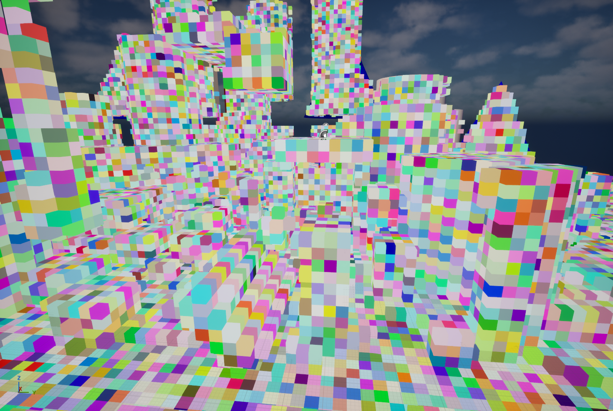 | 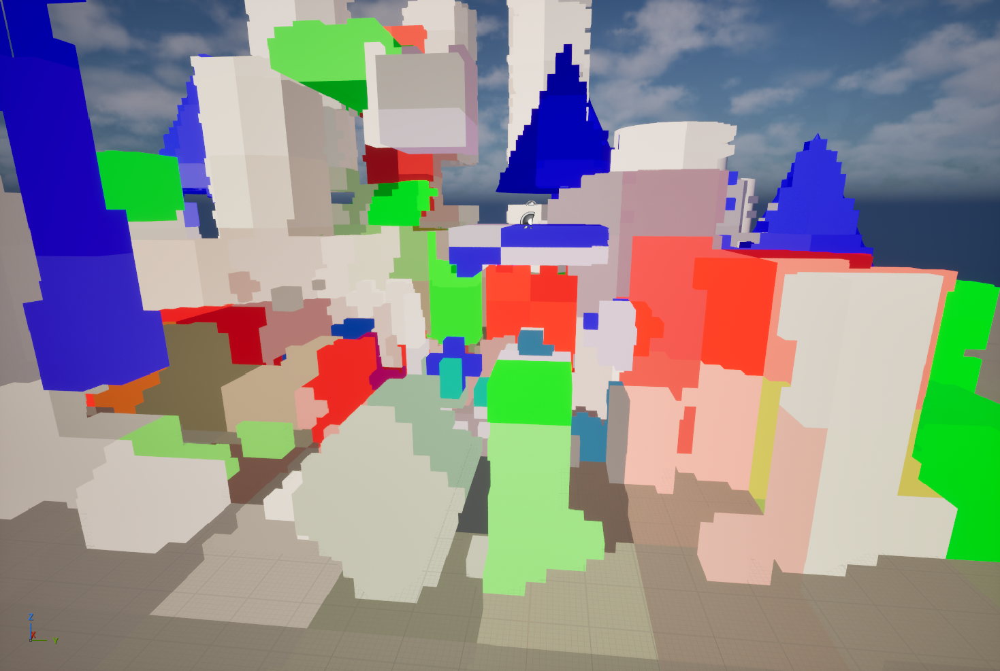 |

### BBV: Bitmask Brick Voxel

BBV はジオメトリ情報は高周波, 材質情報は低周波で保持するために voxle をグループ(brick)単位で管理するデータ構造です。空間を brick grid に分割し、brick 内の voxel occupancy を bitmask として保持します。カメラ追従するToroidalGridで管理され、高速なアクセスのためにDenseなレイアウトを採用しています。デモ実装では 8x8x8 voxel を 1 brickとして 512bit で表現します。

ジオメトリ情報よりも低周波の情報として、 brick毎の材質等の情報を追加で保持します。デモ実装では scene color 由来の輝度を brick 単位の coarse radiance として格納し、RdvGI のレイトレースのヒット位置の輝度としてサンプリングします。

DepthBuffer から復元した surface は voxel **injection** として occupancy に追加します。視点移動および screen coverage の変化で観測されなくなった領域は **removal** で除去します。BBV はこの逐次更新によってリアルタイムにシーンに追従する voxel scene 表現です。

### BBV voxel injection

DepthBuffer の side view から復元した surface sample を BBV brick grid へ直接 injection します。この処理はcompute shaderで実行され、waveintrinsicsを利用した書き込み回数削減をしつつatomic操作で実現されます。

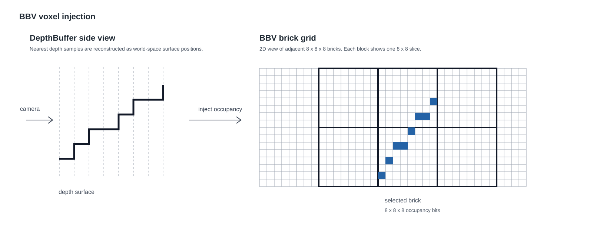

### BBV voxel removal

BBV voxel を current camera view へ投影し、voxel depth と SceneDepth sample を比較します。voxel depth が SceneDepth より小さい場合は occupancy を除去し、それ以外は維持します。

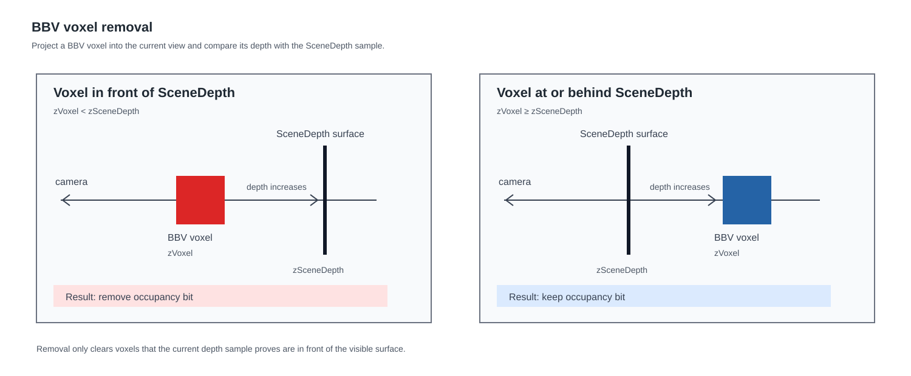

### BBV ray tracing

BBV は Compute Shader から voxel ray tracing できます。ray traversal は BBV occupancy を参照して hit surface を検出します。VSP の visibility capture、probe relocation、debug visualization 等がこの ray tracing を利用しています。hardware ray tracing scene は必要としません。

## RdvGI: Rdv 上で実装される probe based GI

RdvGI は BBV ray tracing を使用する GI 実装です。Enshrouded の GI および SurfelGI と同様に、visible surface を起点に probe を更新します。

VSP は DepthBuffer で観測した surface cell から sparse probe を配置・再利用します。各 probe は BBV ray tracing で octahedral map に radiance と sky visibility を capture し、L1 spherical harmonics へ投影します。投影結果を cascade IrradianceVolume へ伝播・格納します。material evaluation は volume を trilinear sample し、indirect diffuse irradiance と sky visibility IBL を取得します。

probe ray origin は、対応する surface に埋まらない位置へ relocation します。capture に使う origin は relocation で確保します。このため GI evaluation 時に DDGI のような probe validity weight および visibility-weighted interpolation を使用しません。評価時には cascade selection、boundary dither、hardware trilinear filtering、SH evaluation を行います。

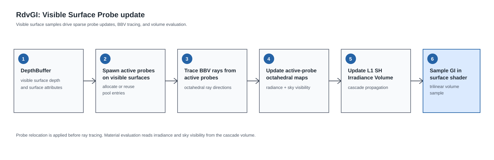

ActiveProbe の octahedral map は BBV ray trace の radiance と sky visibility を保持します。

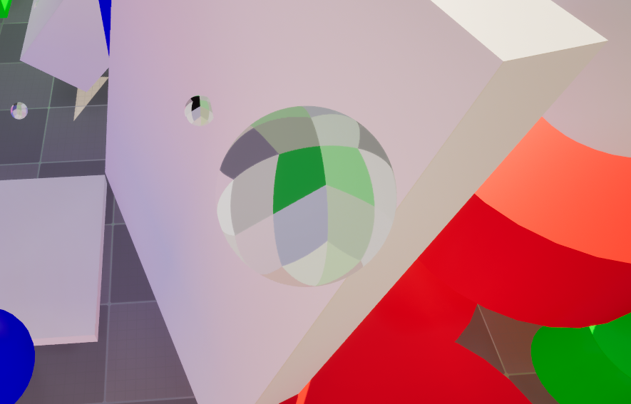

ActiveProbe と IrradianceVolume のデバッグ表示です。

| ActiveProbe | IrradianceVolume |
|---|---|
| 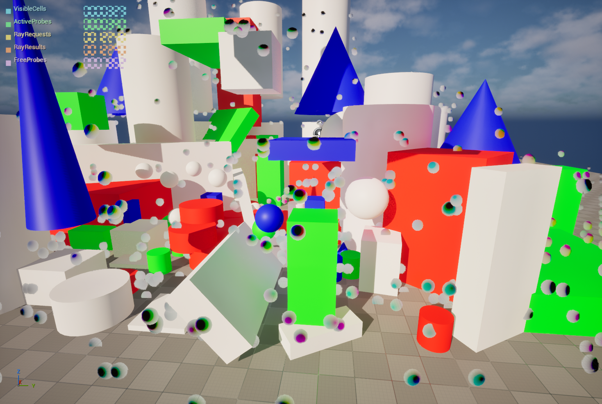 | 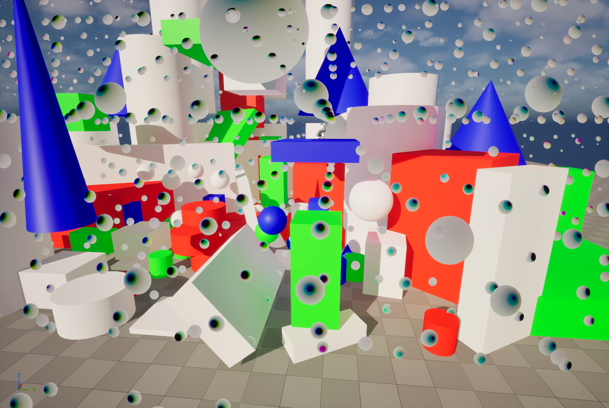 |

## GPU 更新フロー

InstantRDV の更新は選択した MainView を入力とします。BBV geometry は BasePass 前に更新し、BrickRadiance と VSP は lighting 後かつ tonemap 前に更新します。後者は同一 ViewFamily の一つの view を入力として 1 回だけ実行します。

1. **Toroidal BBV の追従**: camera position に応じて BBV grid を移動し、新たに流入した brick を clear します。
2. **Surface sample の構築**: MainView の SceneDepth から world-space surface position を復元します。ReducedSurface path では depth、normal、normal confidence を低解像度の surface sample として保持します。この sample は geometry、BrickRadiance、VSP の各更新で共有します。
3. **Geometry の逐次更新**: surface sample を BBV voxel へ injection します。現在の depth surface より手前に残る voxel は removal で除去します。injection は Wave Intrinsics で同一 occupancy word の更新を集約してから atomic 操作を行います。
4. **BrickRadiance の更新**: lighting 後、tonemap 前の SceneColor を occupancy surface へ対応付けます。brick ごとに蓄積・平均した coarse radiance は、後段の BBV ray trace の hit radiance になります。
5. **Visible Surface Probe の更新**: visible surface を VSP cell へ対応付け、可視 cell だけを compact します。probe pool から必要な probe を割り当て、surface anchor と BBV ray tracing で probe origin を relocation します。
6. **Probe capture**: active probe ごとに 6x6 octahedral directions の ray を生成し、BBV occupancy を trace します。hit は brick radiance、miss は sky visibility として ActiveProbe の octahedral map へ反映します。処理量は grid 全体ではなく active probe と ray request の数で決まります。
7. **IrradianceVolume の更新**: octahedral map を L1 SH へ積分し、probe owner cell の IrradianceVolume を更新します。probe がない cell には近傍の SH を checkerboard propagation します。

Material shader は更新処理とは別に、cascade IrradianceVolume を trilinear sample します。cascade selection と boundary dither の後、L1 SH を surface normal で評価して diffuse irradiance と sky visibility IBL を取得します。

## Unreal Engine integration

### Debug menu

`Tools > Debug > Instant-RDV > Instant-RDV Debug` からデバッグメニューを開きます。メニューは Runtime、BBV、VSP、Debug の4区分です。Runtime では InstantRDV、RdvGI、ReducedSurfaceBuffer の有効・無効を切り替えます。BBV と VSP では各更新処理と評価方式を確認できます。Debug では BBV、ActiveProbe、IrradianceVolume を可視化できます。

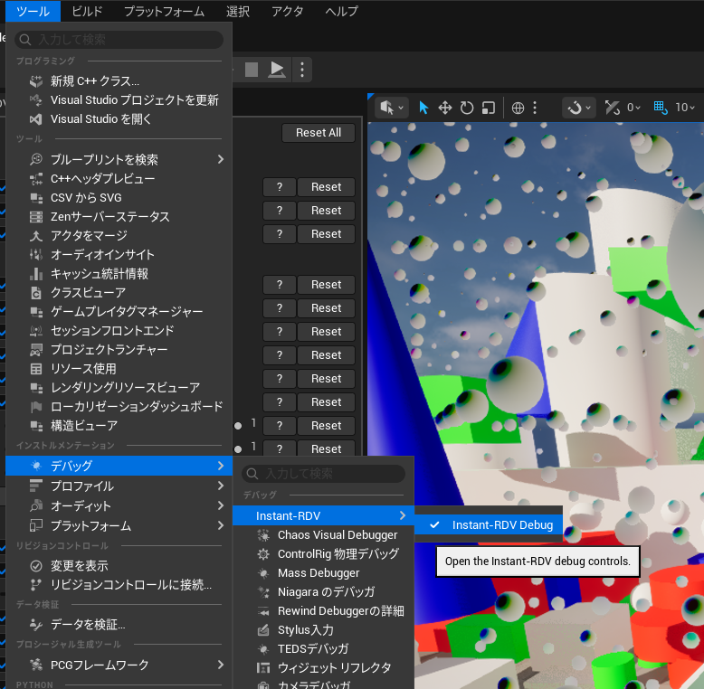

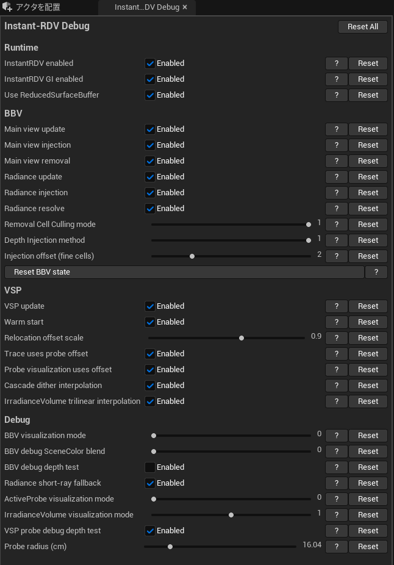

### Level Settings Actor

`InstantRdvSettingsActor` は `Plugins > Instant-RDV > InstantRdv > Public` にある Actor class です。この Actor をレベルへ配置し、Details パネルでレベルごとの設定を変更します。`Enabled` は BBV を含む InstantRDV の有効・無効を切り替えます。`Gi Enabled` は VSP 更新とマテリアルからの GI 出力を切り替えます。BBV の更新は `Gi Enabled` の影響を受けません。BBV、VSP、Rendering、LOD、Relocation にはレベルごとのパラメータがあります。

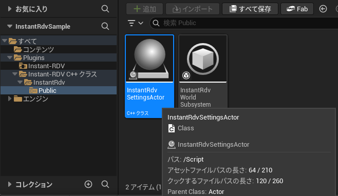

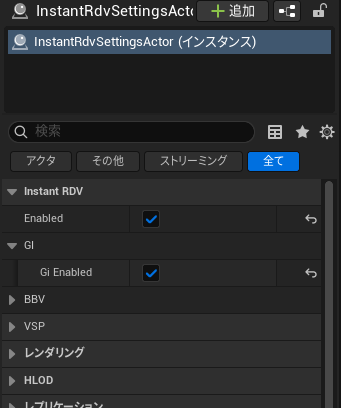

CVar では各機能を実行時に無効化できます。

- `r.InstantRdv.Enable`: InstantRDV 基幹機能。
- `r.InstantRdv.Gi.Enable`: RdvGI。

両 CVar の既定値は有効です。Settings Actor の `Enabled` と `Gi Enabled` の既定値は無効です。レベルに Actor を配置して必要な機能を有効化するまで処理は実行されません。

### Material Function

`MF_Irdv_SampleGi` はプラグインの Content に含まれる Material Function です。Material Graph から呼び出し、`InSamplePosition` に Absolute World Position、`InSampleNormal` に VertexNormalWS を接続します。内部の Custom Node は `instant_rdv_material.ush` を include し、`InstantRdvMaterialTryEvaluateIndirectLighting` を呼び出します。

出力 `Irradiance` は入射照度 `E` です。`Irradiance/PI` は `E / PI` です。Lambert diffuse として Emissive へ加算する場合は、Base Color と `Irradiance/PI` を乗算します。`SkyVisibility` は SkyLight / IBL 用の遮蔽係数です。

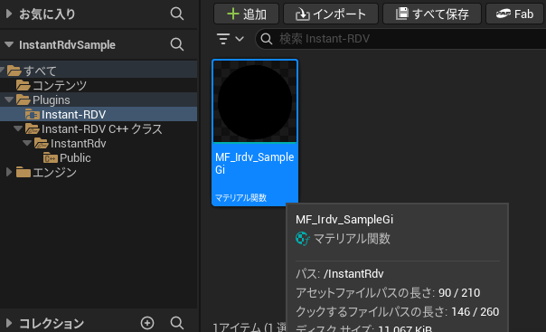

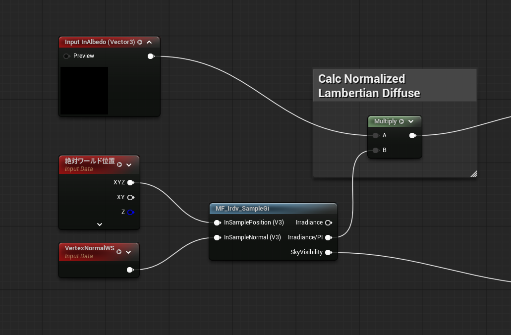

## 実装上の注記

- BBV の main-view injection / removal、radiance update、VSP update、reduced-surface path は CVar で個別に観察できます。
- VSP の probe pool、active probe list、ray request/result、probe atlas、IrradianceVolume は GPU resource として管理します。
- VSP は GI を無効にしても GPU resource を確保したままです。
- MainView 外の BrickRadiance は更新しません。高輝度 brick が画面外へ移動した後も残ります。

## 初期パラメータ

| 項目 | 既定値 |
|---|---:|
| BBV grid | `64 x 64 x 64` bricks |
| BBV brick size | `300 cm` |
| VSP grid | `16 x 16 x 16` cells per cascade |
| VSP cell size | `200 cm` |
| VSP cascade count | `5` |
| Sparse probe pool | `8192` probes shared across cascades |
